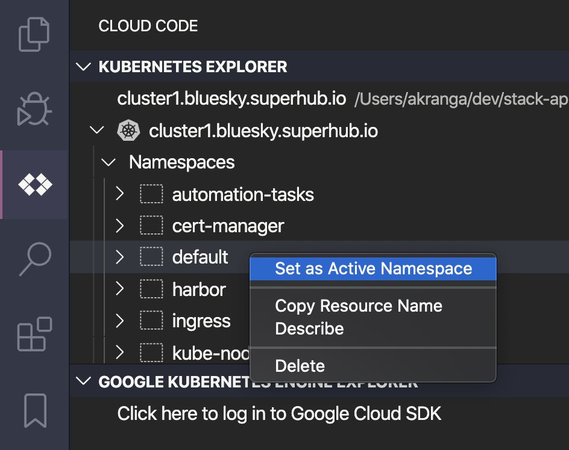
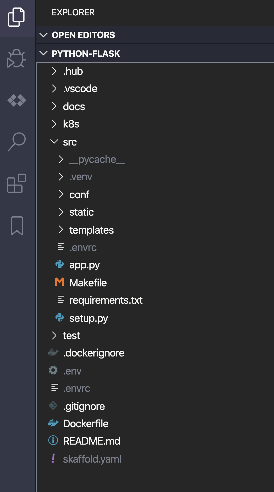
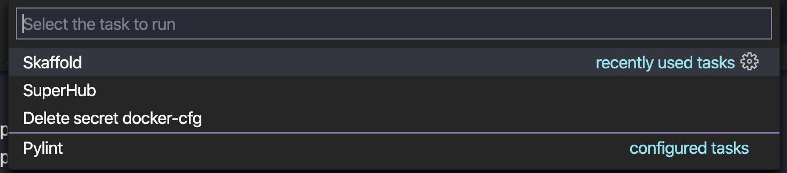
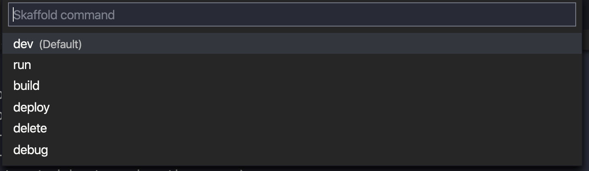
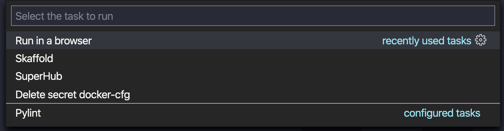
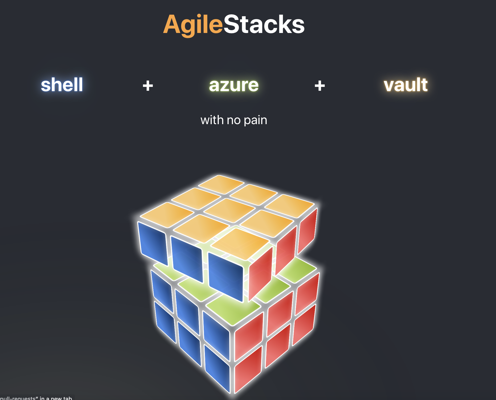
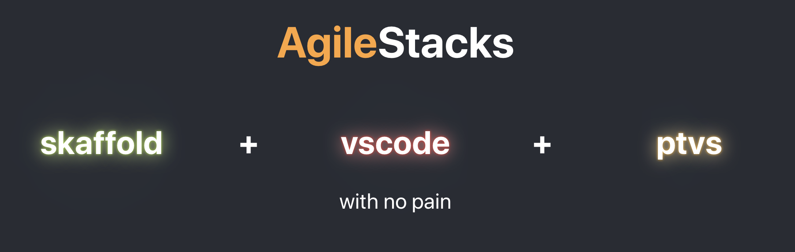
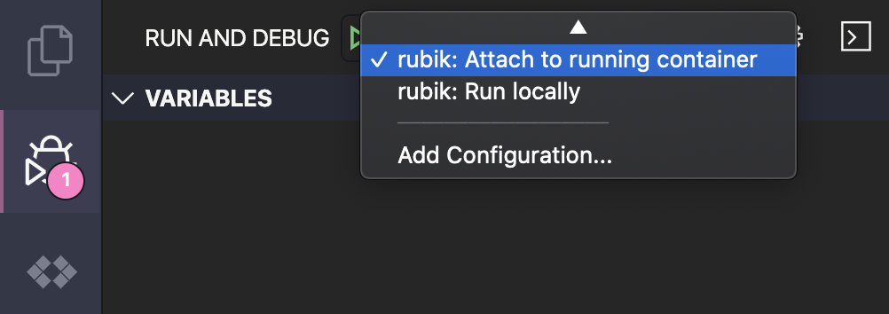
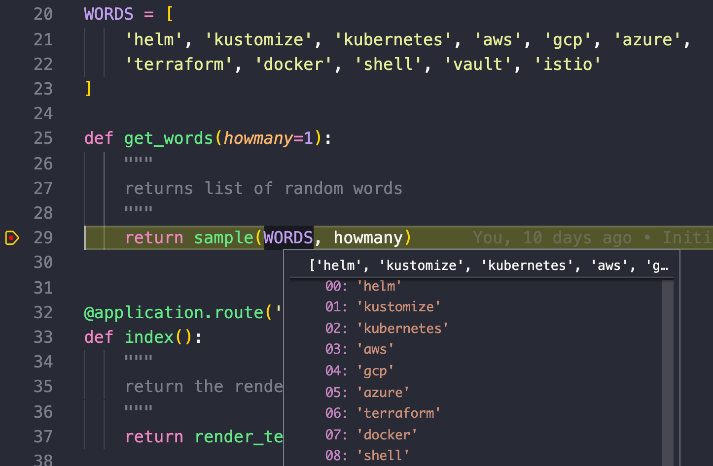

# Development Workflow on Kubernetes - Local Development with Skaffold

The goal of this tutorial is to provide automation for developer workflow on Kubernetes. Building applications for Kubernetes enables significant advantages for application availability: deployment automation, fault-tolerance, auto-scaling, load balancing, and rolling service updates. However, Kubernetes is still new for many development teams, and tools for building Kubernetes applications are still evolving. This tutorial provides step-by-step guidance on implementing Python development workflow with Kubernetes, Hub CLI, Skaffold, and Visual Studio Code extensions.

One of the challenges in adopting Kubernetes is answering the following common questions: how do I develop locally, how should I test, and how can I debug? Deploying each code change to a remote Kubernetes cluster forces developers to spend a lot of time waiting, which is not good for developer productivity and happiness. At the same time, local testing is hard because of multiple dependencies that have to be deployed locally to allow for local testing. The optimal development workflow will allow us to quickly test and debug local changes of your code, without having to deploy all microservices and databases on local machine.

By automating the local development workflow, we can significantly shorten the deployment cycle time while reducing the effort to configure and maintain local environments.

You will perform the following steps:
1. [Setup the application](README.md#setup-the-application)
2. [Setup VS Code](README.md#setup-vs-code-and-skaffold)
3. [Deploy to Kubernetes](#deploy-to-kubernetes)

Depending on your previous experience with Kubernetes and Python, this tutorial should take approximately 25 minutes to complete.

## Setup the Application

1. You need the following software to be installed on local machine:

* `vscode`: Visual Studio Code IDE for Python. Installation instructions are [here](https://code.visualstudio.com/docs/setup/mac)
* `hub`: SuperHub CLI (installation notes below) to manage and configure your infrastructure
* `skaffold`: to automate the workflow for building and deploying your application
* `jq`: JSON parser for SuperHub API routines
* `yq`: for JSON to YAML conversion
* `jsonnet`: for code generation
* `kubectl`: command line tool for controlling Kubernetes clusters
* `make`: to control the code generation routines

On MacOs you can easily install these tools and utilities with Homebrew:

`brew install jq yq jsonnet skaffold kubectl cmake`

2. To start using Hub CLI, download and install the executable file using the example for your platform.

*On MacOS*
```bash
curl -Lo hub https://controlplane.agilestacks.io/dist/hub-cli/hub.darwin_amd64
chmod +x hub
sudo mv hub /usr/local/bin
```

*On Linux*
```bash
curl -Lo hub https://controlplane.agilestacks.io/dist/hub-cli/hub.linux_amd64
chmod +x hub
sudo mv hub /usr/local/bin
```

3. Get application source code

```bash
$ git clone https://github.com/agilestacks/stack-apps.git
$ cd stack-apps/apps/python-flask
```
Let's review the files downloaded for the application template:

```
python-flask:
  /.hub             # SuperHub code generation has been located here
  /.vscode          # Configuration for vscode
  /src              # Our python application has been located here
  /test             # Container structure texts will be here
  Dockerfile        # docker image with your application
```

4. Retrieve SuperHub authentication token.

You can retrieve your API token from (SuperHub UI)[https://controlplane.agilestacks.io/#/user/profile] or using Hub CLI.

Use the following command to retrieve the authentication token using Hub CLI:
```
$ hub login
Username: john.doe@example.com   # your SuperHub control plane username
Password: **********             # your SuperHub control plane password

export HUB_TOKEN=sergd......kieud
```

You need to export `HUB_TOKEN` environment variable to provide authentication for Hub CLI. This step will configure Hub CLI and generate your application configuration for the specified Kubernetes cluster.
If you don't know your SuperHub username and password, you can register for a free account (Register)[https://www.agilestacks.com/register]

Run the following commands:
```
$ echo $HUB_TOKEN
sergd......kieud

$ hub-ls -p harbor -p kubernetes
cluster1.bluesky.superhub.io
cluster2.bluesky.superhub.io
```
Note: your environment may use Kubernetes cluster names that are different from this example.

The code above will validate that `HUB_TOKEN` environment variable has been defined.

Hub-ls command uses this token to fetch a list of all deployed clusters that provide required capabilities: `Kubernetes` platform and `Harbor` private docker registry. This code also confirms that you have a running Kubernetes cluster where the application can be deployed.

5. Apply cluster configuration to your application code.

Run the following commands:
```bash
$ hub-configure -s cluster1.bluesky.superhub.io
# cluster1.bluesky.superhub.io is the target cluster

$ source .hub/current
$ kubectl cluster-info
Kubernetes master is running at https://cluster1.bluesky.superhub.io
```

`hub-configure` command is used to specify the cluster name where the application is going to be deployed.  Please replace   `cluster1.bluesky.superhub.io` with the name of your cluster. When you executed `hub-configure` command, SuperHub will save Kubernetes cluster configuration file (kubeconfig) in the following directory: `.hub/env`.  Also, it will create a symlink pointer to the actual cluster configuration: `.hub/current`

For more information about how to customize or extend the cluster configuration, refer to the following article: [here](TBD)

Next, you will generate the application configuration files. You need to generate new configuration files each time you change your cluster.

```bash
$ make -C ".hub" generate
Generated: ../skaffold.yaml
Generated: ../k8s/deployment.yaml
Generated: ../k8s/ingress.yaml
Generated: ../k8s/kaniko-secret.yaml
Generated: ../k8s/service.yaml
Generated: ../.hub/dockerconfig.json
Generated: ../.vscode/launch.json
Generated: ../.vscode/settings.json
Generated: ../.vscode/tasks.json
```

By running Make, you have generated the necessary configuration files for Kubernetes. Examine the configuration files located in `.hub` directory:
```
/python-flask/.hub/env/kubeconfig.cluster_name.superhub.io.yaml
/python-flask/.hub/env/configure
/python-flask/.hub/.vscode/settings.jsonnet
/python-flask/.hub/.vscode/launch.jsonnet
```

You have generated a set of configuration files to deploy the application with Skaffold. The most important files are:

* `skaffold.yaml`: a configuration file for Skaffold
* `k8s/*.yaml`: kubernetes deployment manifests
* `.vscode/*.json`: configuration for vscode
* `.hub/dockerconfig.json`: a docker auth file. Will be used by Skaffold by as `docker-cfg` secret to push image into docker registry.

More details about code generation and conventions can be found [here](TBD)

## Setup the Development Environment

For Python development we will use Visual Studio Code with additional plugins such as [Google CloudCode](https://cloud.google.com/code/docs/vscode/).
Alternative setup for IntelliJ can be found [here](https://cloud.google.com/code/docs/intellij/)

1. Install required plugins

```bash
$ code \
  --install-extension "googlecloudtools.cloudcode" \
  --install-extension "heptio.jsonnet" \
  --install-extension "ms-azuretools.vscode-docker" \
  --install-extension "ms-kubernetes-tools.vscode-kubernetes-tools" \
  --install-extension "ms-python.python" \
  --install-extension "redhat.vscode-yaml" \
  --install-extension "xrc-inc.jsonnet-formatter"
```

2. Open VS Code from the application directory

```
$ code -n .
```

## Setup VS Code and Skaffold

With the local development environment configured, you’re now ready to launch your application. Typically, you’d have to perform several tedious and error-prone tasks to build Docker containers and create Kubernetes configuration files. Fortunately, Skaffold is the tool that automatically generates required Kubernetes manifests. Skaffold also watches for code changes, and once a change is detected, Skaffold automatically initiates the steps to build, push and deploy the new code to a Kubernetes cluster.

In the previous section you have executed `make -C ".hub" generate`. TThis command has generated VS Code configuration files that you can view in `/.vscode` directory. You have also installed several VS Code (extensions)[.vscode/extensions.json]. One of the extensions is the (Cloud Code)[https://cloud.google.com/code/docs/vscode/], which allows to integrate Skaffold with VS Code.

### Select a namespace for Skaffold

 On the left side you should be able to see a tab with `<>` icon (Cloud Code). Please select it. Then you should be able to see a kubernetes cluster. Select a target namespace (right click on the desired namespace) for the application (`default` should be good enough).  The target namespace for your application is configurable.  Skaffold will deploy the app in the selected target namespace.

Hint: To open Kubernetes Dashboard, select the cluster and `Right click >> Open Dashboard`

In this step you have validated connectivity between VS Code and a Kubernetes cluster. Spend a few minutes exploring the cluster. Next, switch to the source code view: open "Explorer" (`Shift + Cmd + E`).

## Walk through the source code

 Let's review the example Python Flask application. All application specific source code is available in `/src` directory
```
/src
  app.py            # Flask application goes here
  /static           # CSS, JavaScript and other media goes here
  /templates        # Home for HTML templates, managed by Flask
  /conf             # Flask environment configuration goes here
  requirements.txt  # Our dependencies (managed by pip)
/k8s                # Generated by the jsonnet kubernetes manifests, managed by Skaffold
/test               # Container structure tests (see: https://github.com/GoogleContainerTools/container-structure-test)
Dockerfile          # A docker file, managed by Skafold
skaffold.yaml       # Skaffold configuration file
```

### Python Flask application

`app.py` is a simple web application. It has a router for
* `/` - to return our single page HTML
* `/gimme/<int:howmany>` - returns a JSON array with random words (size: `howmany` variable)
* `/status` - for Kubernetes health checks

By default, the application comes with remote debug enabled.
```python
if application.config["PTVSD_PORT"]:
  import ptvsd
  ptvsd.enable_attach(address=('0.0.0.0', application.config["PTVSD_PORT"]))
```

For remote debug, the application is integrated with [ptvsd](https://github.com/microsoft/ptvsd), a Python debugger package. It supports integration with vscode (see: [here](https://code.visualstudio.com/docs/python/debugging))and with Skaffold (see [here](https://skaffold.dev/docs/workflows/debug/#python)).

### Dockerfile

The Dockerfile is based on Python 3.7 and exposes two ports:
* `80` for a flask application (standart HTTP port)
* `3000` for ptvsd for remote debug.

Note about *PRODUCTION* use: It is recommended to disable remote debugging for production environments. To disable the debugger, you need to make changes in the following two files: `src/app.py` and `Dockerfile`. For production deployments, it is also recommended to define [gunicorn](https://gunicorn.org) (or any other WSGI server of your choice) as entrypoint instead of python + flask.

```dockerfile
# CMD ["python3", "-m", "flask", "run", "--no-debugger", "--no-reload"]
ENTRYPOINT ["gunicorn", "-b", "0.0.0.0:80", "app"]
```
## Deploy to Kubernetes

1. You will deploy the application to Kubernetes with Skaffold. To run a number of predefined tasks in VS Code, press `CMD + Shift + P` and select `Run Task`. Here you should be able to see a number of predefined tasks. You can customize tasks in `.vscode/tasks.json`



2. Select `Skaffold >> dev`. More about skaffold stages can be found [here](https://skaffold.dev/docs/pipeline-stages/)



Note: `CMD + Shift + B` is a vscode shortcut for a build task.

Alternatively you can run the same command in the terminal
```
$ source .env   # skip if you have already done this
$ skaffold dev
```

You should be able to see the following output:
```
> Executing task: skaffold dev <

Listing files to watch...
 - rubik
Generating tags...
 - rubik -> cluster1-harbor.app.cluster1.bluesky.superhub.io/library/rubik:20200213-174151
Checking cache...
 - rubik: Found. Tagging
Tags used in deployment:
 - rubik -> cluster1-harbor.app.cluster1.bluesky.superhub.io/library/rubik:20200213-174151@sha256:07b0c3ccebabfb0337e016e59bae20ee5b6cb3b05d6e7f320db98ea45841fce9
Starting deploy...
 - deployment.apps/rubik configured
 - ingress.extensions/rubik configured
 - secret/rubik-dockerconfig configured
 - service/rubik configured
Watching for changes...
[rubik-76f8bf44f8-tjdrx application]  * Serving Flask app "app.py"
[rubik-76f8bf44f8-tjdrx application]  * Environment: docker
[rubik-76f8bf44f8-tjdrx application]  * Debug mode: on
[rubik-76f8bf44f8-tjdrx application]  * Running on http://0.0.0.0:80/ (Press CTRL+C to quit)
```

Let's review the output of `skaffold dev` command:

1. Skaffold has created a Docker image for the application. By default, timestamp is used as Docker image tag (image tag configuration can be customized via `skaffold.yaml`)
2. The Docker image was pushed to Harbor docker registry. To build Docker images on the server, it is using [kaniko](https://github.com/GoogleContainerTools/kaniko). If you prefer to build and push Docker images to your local workstation, then you can switch to the local profile
```bash
export SKAFFOLD_PROFILE=local
```
3. Kubernetes manifests from /k8s directory were applied to the selected cluster (Skaffold also maintains a deployment image)
4. Skaffold continues to run in the background, waiting for code changes, and ready to automatically rebuild and redeploy the application when local files are changed.


### Access the deployed application

There are several ways to access and test the deployed application from the browser.

*Via vscode tasks* shortcut (`CMD+Shift+P` or `F1`), type `Tasks: Run Task` and then select: `Ingress: Open in browser`



*Via ingress document* - defined in file: `k8s/ingress.yaml`

*Via command line* with following bash script
```bash
$ kubectl get ingress --all-namespaces

NAMESPACE     NAME                             HOSTS
default       rubik                            rubik.app.cluster1.bluesky.superhub.io
harbor        cluster1-harbor-harbor-ingress   cluster1-harbor.app.cluster1.bluesky.superhub.io
...
```
Based on the output above, you can access the application using the following URL:
[https://rubik.app.cluster1.bluesky.superhub.io](https://rubik.app.cluster1.bluesky.superhub.io)




Congratulations, you have successfully deployed Python Flask application on Kubernetes!

## Update and reload code inside of the running Pod

When `skaffold dev` command is running, you should see following log in the terminal
```
Watching for changes...
[rubik-7d9655fcdc-dv8fv application]  * Serving Flask app "app.py"
[rubik-7d9655fcdc-dv8fv application]  * Environment: docker
[rubik-7d9655fcdc-dv8fv application]  * Debug mode: on
[rubik-7d9655fcdc-dv8fv application]  * Running on http://0.0.0.0:80/ (Press CTRL+C to quit)
```

Skaffold is watching for changes in the application source code. Once any application files are changed, skaffold will sync up changes to the running container (additional details [here](https://skaffold.dev/docs/pipeline-stages/filesync/)). This operation doesn't require a new image build. You can configure files and directories that skaffold is monitoring for changes. Open a `skaffold.yaml` and you should be able to see the following:

```yaml
build:
  artifacts:
  - image: rubik
    sync:
      manual:
      - dest: /app
        src: src/**/*.py
        strip: src/
      - dest: /app
        src: src/static/**
        strip: src/
```

Next, you can open file `src/app.py` and change the following code
```python
WORDS = [
    'helm', 'kustomize', 'kubernetes', 'aws', 'gcp', 'azure',
    'terraform', 'docker', 'shell', 'vault', 'istio'
]
```

Let's add some more words into array. For example: `"skaffold", "flask", "ptvs", "vscode"` so our code will look like
```python
WORDS = [
    'helm', 'kustomize', 'kubernetes', 'aws', 'gcp', 'azure',
    'terraform', 'docker', 'shell', 'vault', 'istio',
    "skaffold", "flask", "ptvs", "vscode"
]
```
Save the file (`CMD+S`)

ou will see the following Skaffold logs updates in the Tasks output window:
```
Watching for changes...
[rubik-7d9655fcdc-dv8fv application]  * Serving Flask app "app.py"
[rubik-7d9655fcdc-dv8fv application]  * Environment: docker
[rubik-7d9655fcdc-dv8fv application]  * Debug mode: on
[rubik-7d9655fcdc-dv8fv application]  * Running on http://0.0.0.0:80/ (Press CTRL+C to quit)
Syncing 1 files for cluster1-harbor.app.cluster1.bluesky.superhub.io/library/rubik
Watching for changes...
```

Once you see the message `Detected change in '/app/app.py', reloading`, open the internet browser using the following commands: (`CMD+Shift+P >> Run Task >> Open in browser`). Move your mouse over the Rubik's kube displayed in the browser. Mouse events are routed to `/gimme` endpoint. These events will update various messages displayed in the browser.



## Remote debugging

Now let's do some debugging. This is a bit tricky because, our python application has been wrapped into a docker container, which is running inside kubernetes. So, we will use a tool chain of:
* `Visual Studio Code` - IDE
* `ptvsd` - Python debugger for VS Code
* Docker should expose port `3000` (can be reconfigured to a different port)
* Task in `launch.json` in vscode should point to the same port (`3000`)
* `Flask` application should be running with `--no-reload`, in our case controlled via environment variable `FLASK_RUN_RELOAD=0`

Notice that it's not possible to have both automated code sync and the remote debug. Good news, you don't need to redeploy the application to change these settings. Skaffold will do it for you. To enable remote debugging, perform the following steps:

1. Modify a `Dockerfile` (see below) and save:
```dockerfile
ENV FLASK_RUN_RELOAD 0
```

2. Skaffold will rebuild the container automatically. You can see the progress in the terminal window of `Task - Skaffold`
Once the application has been rebuilt and the pod is restarted, you will see "Running on http://0.0.0.0:80/" message again:
```
...
Starting deploy...
 - deployment.apps/rubik configured
Watching for changes...

* Serving Flask app "app.py"
* Environment: docker
* Debug mode: on
* Running on http://0.0.0.0:80/ (Press CTRL+C to quit)
```



3. Once the application has been rebuilt and pod restarted you should be able to see welcome message again:

```
...
Starting deploy...
 - deployment.apps/rubik configured
Watching for changes...

* Serving Flask app "app.py"
* Environment: docker
* Debug mode: on
* Running on http://0.0.0.0:80/ (Press CTRL+C to quit)
```

4. To bring up the `Debug` view, select the Debug icon in the Activity Bar on the side of VS Code. You can also use the keyboard shortcut ⇧⌘D. Select `Attach to running container` from the dropdown of run configurations:

Important note: make sure you are running flask in with 'no-reload' option. In addition to the `Dockerfile`, auto-reload control flag `FLASK_RUN_RELOAD` can be declared in `k8s/deployment.yaml` as a pod env.

You can now place a breakpoint in `src/app.py`. Breakpoints can be toggled by clicking on the editor margin or using F9 on the current line. For example, try setting a debug breakpoint in `get_words()` function.

In addition to a breakpoint, you can also setup a logpoint. VS Code Logpoint is represented by a "diamond" shaped icon. Log messages are plain text, but can include expressions to be evaluated within curly braces ('{}').

5. Open your application in a web browser (`CMD+Shift+P >> Run Task >> Open in browser`) and trigger an event by moving your mouse pointer over the cube.



# Conclusion

Congratulations! You have created a Flask application, wrapped it in Docker container, pushed it to a private Docker registry. Then you scheduled a Kubernetes deployment and enabled live reloads with Skaffold and remote debugging with ptvsd for your applications running on Kubernetes. You have learned how to use Hub CLI, VS Code, and Skaffold to configure, deploy, and debug an application on Kubernetes. While it may sound complex, this is the reality of current state of Kubernetes deployments. Unless you automate the entire workflow, developers have to manually perform configuration instead of writing application code. By automating the local development workflow, you can shorten the feedback loop, reduce misconfiguration errors, and reduce the effort to maintain local environments. Even if you happen to break your configuration, you can use automation to regenerate it.

In the next tutorial (coming soon), you can learn about how to use SuperHub to link a component, such as a database, with your application.

